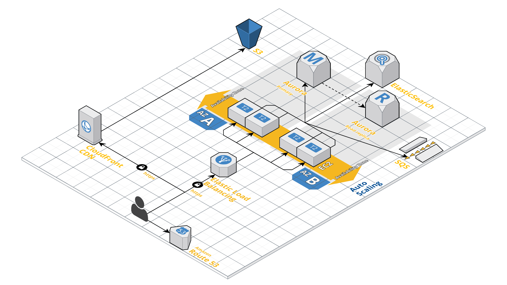

# Deploying Laravel with Amazon ECS, AWS CloudFormation and an Application Load Balancer

This reference architecture provides a set of YAML templates for deploying a Laravel application (with its crons and workers) to [Amazon EC2 Container Service (Amazon ECS)](http://docs.aws.amazon.com/AmazonECS/latest/developerguide/Welcome.html) with [AWS CloudFormation](https://aws.amazon.com/cloudformation/).

The architecture features high security and high availability, and can be adjusted based on your hosting budget. All details on Medium [here](https://hackernoon.com/laravel-on-aws-a-reference-architecture-a680755130d0)

## Overview

The repository consists of a set of nested templates that deploy the following:

 - A tiered [VPC](http://docs.aws.amazon.com/AmazonVPC/latest/UserGuide/VPC_Introduction.html) with public and private subnets, spanning an AWS region.
 - A highly available ECS cluster deployed across two [Availability Zones](http://docs.aws.amazon.com/AWSEC2/latest/UserGuide/using-regions-availability-zones.html) in an [Auto Scaling](https://aws.amazon.com/autoscaling/) group.
 - (optional) A pair of [NAT gateways](http://docs.aws.amazon.com/AmazonVPC/latest/UserGuide/vpc-nat-gateway.html) (one in each zone) to handle outbound traffic.
 - The Laravel application and its crons and workers deployed as [ECS services](http://docs.aws.amazon.com/AmazonECS/latest/developerguide/ecs_services.html) (Dockerfiles for Laravel and Nginx provided).
 - An [Application Load Balancer (ALB)](https://aws.amazon.com/elasticloadbalancing/applicationloadbalancer/) to the public subnets to handle inbound traffic.
 - A S3 Bucket and a corresponding CloudFront distribution
 - SSL certificates for the CloudFront Distribution and the ALB
 - SSL offloading on the ALB so you don't have to manage certificates in your Nginx containers
 - All traffic is forced to HTTPS, and traffic to the www subdomain is redirected to the apex domain.
 - Centralized container logging with [Amazon CloudWatch Logs](http://docs.aws.amazon.com/AmazonCloudWatch/latest/logs/WhatIsCloudWatchLogs.html).
 - CloudWatch monitoring alarms for the database and web instances
